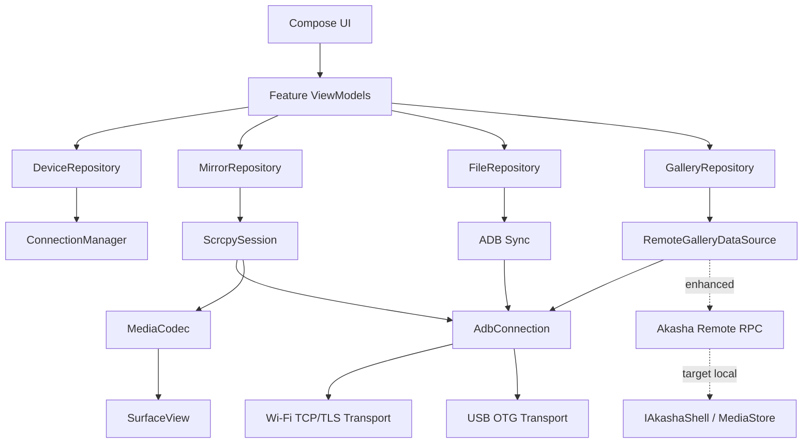

# Phone Mirror Phone — Android 主控端技术调研与落地架构建议

> 调研日期：2026-08-31  
> 目标分支：`feature/phone-mirror-phone`  
> 目标仓库：`d:\study\androidplay\phone_mirror_phone`  
> 目标：在一台 Android 设备上，直接发现、连接、镜像、控制并管理另一台 Android 设备；PC 不再是必需组件。

---

## 结论摘要

**最终推荐：原生 Kotlin + Jetpack Compose，ADB 协议完全内置到 App 进程，屏幕链路复用官方 `scrcpy-server`，Android 主控端自行实现轻量 scrcpy client 协议并使用 `MediaCodec + Surface` 硬解。**

不要把“Android 版 scrcpy client”理解为“把官方 C/SDL 客户端整体 NDK 搬过来”。更低风险的实现是：

```text
Controller Android App
    │
    ├─ ADB transport
    │   ├─ Wi‑Fi legacy TCP
    │   ├─ Android 11+ Wireless Debugging TLS + pairing
    │   └─ USB OTG / UsbManager / raw ADB bulk endpoints
    │
    ├─ ADB services
    │   ├─ shell,v2
    │   ├─ sync:        <-- push/pull/list/stat
    │   └─ localabstract:scrcpy_<scid>
    │
    └─ scrcpy native-Android client
        ├─ push/start pinned scrcpy-server
        ├─ video stream -> MediaCodec -> SurfaceView
        ├─ optional audio -> MediaCodec/AudioTrack
        └─ control stream <- touch/key/clipboard
```

这条路线已经不只是理论：截至 2026-08-31，开源项目 **[feggaa/scrcpy-android（Scropy Android）](https://github.com/feggaa/scrcpy-android)** 明确实现了 Android→Android、Wireless Debugging 配对、mDNS、USB OTG、内置 ADB、屏幕镜像和 Shell。仓库仍非常年轻，因此**适合做参考实现和代码矿山，不建议未经审计直接作为核心生产依赖**。

### 推荐技术栈一览

| 子系统 | 推荐方案 | 推荐度 |
|---|---|---:|
| UI | Kotlin + Jetpack Compose | ⭐⭐⭐⭐⭐ |
| 视频承载 | `SurfaceView`/`Surface`，Compose 用 `AndroidView` 包装 | ⭐⭐⭐⭐⭐ |
| ADB | App 内 Kotlin/Java ADB client，自有统一 transport abstraction | ⭐⭐⭐⭐⭐ |
| Wi‑Fi | legacy TCP + Android 11+ TLS pairing + mDNS | ⭐⭐⭐⭐⭐ |
| USB OTG | `UsbManager` + ADB USB bulk interface | ⭐⭐⭐⭐⭐ |
| scrcpy | **官方 server + Kotlin client protocol + MediaCodec** | ⭐⭐⭐⭐⭐ |
| 完整 C/SDL client NDK 移植 | 仅作参考/最后手段 | ⭐⭐ |
| 文件传输 | ADB `sync:`，做真正流式 push/pull | ⭐⭐⭐⭐⭐ |
| 相册 | Remote MediaProvider adapter + 本地 Room/cache + DeviceIoScheduler 思路 | ⭐⭐⭐⭐⭐ |
| Shizuku/Dhizuku | **增强能力，不作为基本连接前提** | ⭐⭐⭐⭐ |
| 自研目标端推流 Agent | 第二阶段 Enhanced Mode | ⭐⭐⭐ |
| `screencap + input` | 应急 fallback | ⭐⭐ |

### 三个必须先纠正的认知点

1. **官方 scrcpy 并没有承诺一个稳定 ABI/API 的“libscrcpy”给第三方直接链接。**  
   官方项目是 server + host client；client/server 内部协议会随版本变化。正确做法是固定一组 server/client 协议版本，而不是把 scrcpy 当稳定 SDK。

2. **Android→Android 的 USB ADB 不是 Android Open Accessory（AOA）。**  
   主控 Android 是 USB Host，通过 `UsbManager` 找目标设备暴露的 ADB vendor-specific interface，直接在 bulk IN/OUT endpoint 上跑 ADB protocol。

3. **无 root 可以完成 Wi‑Fi 与 USB ADB 主控。**  
   真正推荐的方式不是执行外部 `adb` 二进制，而是 App 内实现 ADB protocol。USB 权限由 `UsbManager.requestPermission()` + 目标机“允许 USB 调试”完成。

---

## Part 1: 技术栈选型 — 原生 Android 还是跨端？

## 1.1 Android 原生：Kotlin + Jetpack Compose

**可行性：⭐⭐⭐⭐⭐**  
**推荐程度：⭐⭐⭐⭐⭐ — 首选**

### 优点

- `UsbManager`、`NsdManager`、Binder/AIDL、Shizuku/Dhizuku、`MediaCodec`、`Surface` 都是 Android 原生 API，几乎零桥接成本。
- 视频数据不需要穿过 Dart/JS/.NET UI bridge。
- Kotlin Coroutines/Flow 很适合：
  - ADB socket/USB stream；
  - 每设备限流；
  - reconnect；
  - 生命周期取消；
  - UI state。
- Compose 可以直接通过 `AndroidView` 承载 `SurfaceView`，无需为了 Compose 强行使用 Texture/Bitmap 渲染。
- 现有 Shizuku/Dhizuku `classes.jar` 可以直接通过 Gradle `files(...)` 或本地 module 接入。
- Android 10–16/17 的权限、foreground service、USB lifecycle 等问题都可以在一个技术栈内解决。

### 缺点

- PC WinForms UI 不能直接复用。
- 团队需要承担 Kotlin/Compose 学习成本。
- 部分底层 ADB pairing 仍可能需要极少量 NDK/BoringSSL。

### 推荐说明

本项目的业务边界已经是纯 Android，而且最难的 80% 都是 Android-specific data plane。使用跨端框架并不会减少这些工作，只会多一层桥接。

开源/官方参考：

- [Jetpack Compose](https://developer.android.com/compose)
- [Views in Compose / AndroidView](https://developer.android.com/develop/ui/compose/migrate/interoperability-apis/views-in-compose)
- [feggaa/scrcpy-android](https://github.com/feggaa/scrcpy-android)

---

## 1.2 Flutter

**可行性：⭐⭐⭐⭐**  
**推荐程度：⭐⭐⭐ — 只有未来明确需要多端 UI 时才考虑**

### 优点

- UI 开发效率高。
- Android 原生能力可以通过 Platform Channel / Pigeon / FFI 接入。
- 业务页面、设置页、文件列表等低频 UI 可以跨端。

### 缺点

- ADB、USB、MediaCodec、Surface、Shizuku/Dhizuku 最终仍应写 Kotlin/Java。
- **视频帧、USB packet、ADB stream 不应该穿 Platform Channel。**
- Surface 生命周期、App lifecycle、权限回调、USB detach、后台服务都要做双层状态同步。
- 最终很可能形成“Flutter 只剩 UI 壳，核心仍全部 Native”的架构。

### 正确桥接边界

可以桥：

```text
connect(deviceId)
disconnect()
startMirror(options)
stopMirror()
pushFile(uri)
observeDeviceState()
```

不要桥：

```text
everyVideoPacket(...)
everyUsbPacket(...)
everyTouchMove(...)
rawAdbFrame(...)
```

高频 data plane 必须留在 Android native module 内。

开源/官方参考：

- [Flutter Platform Channels](https://docs.flutter.dev/platform-integration/platform-channels)
- [Flutter FFI](https://docs.flutter.dev/platform-integration/android/c-interop)

---

## 1.3 React Native

**可行性：⭐⭐⭐⭐**  
**推荐程度：⭐⭐ — 不优先**

### 优点

- UI 与业务层迭代快。
- TurboModule/JSI 相比旧 bridge 更适合高性能 native interop。

### 缺点

- 本项目没有明显的 Web/JS 资产可复用。
- 视频 Surface、ADB connection lifecycle、USB permission 仍是 Native 主体。
- 把高频输入/视频搬到 JS 层，会增加延迟、GC 和状态竞态。
- 调试面会同时跨 JS/Kotlin/NDK。

### 推荐说明

如果已有成熟 React Native 团队，可以让 RN 只负责 control plane；否则不值得为本项目引入。

开源/官方参考：

- [React Native Native Platform](https://reactnative.dev/docs/native-platform)

---

## 1.4 .NET MAUI

**可行性：⭐⭐⭐⭐**  
**推荐程度：⭐⭐⭐（C# 团队很强时） / ⭐⭐（一般情况）**

### 优点

- 团队已有 .NET 9 / C# 资产与思维模型。
- .NET for Android 可以绑定 Java/Kotlin/AAR/JNI。
- `AdbHelper`、`DeviceIoScheduler`、`GalleryRepository` 的**抽象和算法设计**可以高度复用。

### 缺点

- WinForms UI 不能直接复用到 MAUI。
- `UsbManager`、`MediaCodec`、Surface、Shizuku/Dhizuku 等依旧需要 Android-specific binding。
- ADB pairing 若有 C/BoringSSL，再增加一层 .NET↔JNI/Native interop。
- 包体、启动与调试复杂度比纯原生高。
- “为了复用 C# 而引入 MAUI”不会消除最难的 Android 工作。

### 推荐说明

如果目标是“Android 主控端”而不是未来 iOS/Windows 共用一套 UI，Compose 更干净。  
如果团队只能高效维护 C#，可以评估 **.NET for Android**，不一定非要 MAUI。

官方参考：

- [.NET for Android](https://learn.microsoft.com/dotnet/android/)
- [.NET MAUI native interop](https://learn.microsoft.com/dotnet/maui/platform-integration/)

---

## 1.5 混合方案：跨端 UI + Native/NDK ADB Core

**可行性：⭐⭐⭐⭐**  
**推荐程度：⭐⭐⭐**

### 优点

- 可以把 UI 与底层隔离。
- 如果未来确实有多个前端，Native core 可以复用。

### 缺点

- 仍需要维护两套运行时/生命周期。
- data-plane bridge 边界设计错误会迅速恶化性能和稳定性。

### 推荐结论

**技术上完全可行，但本项目没有足够收益。**

如果坚持混合方案，应规定：

> Native core 持有 connection、USB fd、ADB stream、decoder、Surface 与控制协议。跨端层只发送命令、接收状态和低频 metadata。

---

## 1.6 Part 1 最终结论

**选 Kotlin + Jetpack Compose。**

推荐基础版本：

- Kotlin；
- Jetpack Compose；
- Coroutines + Flow；
- `SurfaceView`；
- `MediaCodec`；
- Android USB Host API；
- `NsdManager`；
- Room；
- 少量 NDK，仅在 Wireless Debugging pairing 所需的 SPAKE2/BoringSSL 路径无法可靠纯 Java 化时使用。

**不要为了“跨端”把视频/ADB 高速数据链路跨语言复制。**

---

## Part 2: 屏幕镜像与控制 — Android 上如何实现 scrcpy 同等体验？

## 2.1 首先：不要整体移植官方 C/SDL client

官方 scrcpy 开发文档明确把系统分为：

- target 上运行的 `scrcpy-server`；
- host 上运行的 client；
- video/audio/control 使用独立 socket；
- target 使用 Android `MediaCodec` 编码；
- client 尽快解码展示以降低 latency。

参考：

- [Genymobile/scrcpy](https://github.com/Genymobile/scrcpy)
- [scrcpy developer documentation](https://github.com/Genymobile/scrcpy/blob/master/doc/develop.md)

### 最重要的设计变化

**推荐新增“路径 A2”：保留 server，重写 Android-native client，而不是 NDK 移植 desktop client。**

```text
Target Android
  scrcpy-server
      │
      ├── video H264/H265/AV1
      ├── audio optional
      └── control
      │
      │ ADB stream / localabstract
      ▼
Controller Android
  AdbConnection
      │
      ├── VideoReader ──> MediaCodec ──> Surface
      └── ControlWriter <── Touch/Key/Clipboard
```

这能删除：

- SDL；
- FFmpeg/libavcodec（MVP 不需要）；
- desktop window/event abstraction；
- libusb host implementation（用 Android `UsbManager` 替代）。

---

## 2.2 路径 A：完整移植官方 scrcpy C/SDL client

**可行性：⭐⭐⭐**  
**推荐程度：⭐⭐**

### 优点

- 最大程度贴近上游 client。
- 多媒体、输入、音频等已有成熟 desktop 实现。
- 上游 bug 修复较容易做源码 diff。

### 缺点

- SDL window/input 与 Android Activity/Surface 生命周期不匹配。
- FFmpeg 在 Android 上增加包体与 native 维护成本，而 Android 本身已有硬件 `MediaCodec`。
- 官方 desktop USB 方案与 Android `UsbManager` 权限模型不同。
- JNI boundary 增多。
- App 后台/前台、Surface recreation、rotation 会让 desktop-style main loop 很难维护。
- scrcpy client/server protocol 本身不是稳定第三方 API，整体搬运也不能免除版本 pinning。

### 推荐用途

**只作为协议和行为参考，不作为新项目主架构。**

开源链接：

- [Genymobile/scrcpy](https://github.com/Genymobile/scrcpy)

---

## 2.3 路径 A2：官方 scrcpy-server + Kotlin Native Client

**可行性：⭐⭐⭐⭐⭐**  
**推荐程度：⭐⭐⭐⭐⭐ — 主路线**

### 为什么可行

截至本报告日期，**[Scropy Android](https://github.com/feggaa/scrcpy-android)** 已直接证明下列组合可运行：

- Android→Android；
- Wi‑Fi ADB；
- Android 11+ pairing；
- mDNS；
- USB OTG；
- 内置 ADB；
- native Android scrcpy client；
- Shell；
- 屏幕镜像。

仓库 README 明确说明它“reimplements the client side natively for Android using a built-in ADB implementation”。

### 更值得参考的实现思想

它的仓库结构已经体现了正确分层：

```text
adb/
  AdbConnection
  AdbProtocol
  AdbStream
  AdbSync
  AdbPairing
  TlsAdbTransport
  UsbAdbTransport

scrcpy/
  ScrcpyProtocol
  ScrcpySession
  VideoDecoder
  ControlSender
  AudioPlayer
```

其 Android client 使用 `MediaCodec`，而 pairing 部分才使用 native/BoringSSL。  
这个边界非常适合 `phone-mirror-phone`。

### 一个非常重要的简化：直接打开 target localabstract socket

主控端已经有 direct ADB transport 后，可以通过 adbd 打开：

```text
localabstract:scrcpy_<scid>
```

因此**不需要在 Android controller 上真的运行一个 desktop-style adb server，再执行 `adb forward`**。

这意味着连接模型可简化成：

```text
AdbConnection.open("localabstract:scrcpy_xxx")
```

而不是：

```text
adb server :5037
   -> host forward table
   -> TCP localhost socket
   -> device abstract socket
```

### 优点

- Android-native 生命周期。
- 视频零 Bitmap 中转，直接 `MediaCodec -> Surface`。
- 没有 SDL/FFmpeg 负担。
- Wi‑Fi/USB 共用同一 ADB stream API。
- 与现有 `DeviceIoScheduler` 思路非常容易融合。
- 可以逐步实现 protocol，而不必一次搬完 desktop client。

### 缺点

- 要维护一小段 scrcpy protocol。
- scrcpy 内部协议会变化，必须 pin server。
- 音频、multi-touch、clipboard、display switching 等需要逐项实现。
- Scropy 项目目前很年轻，不能当作成熟 SDK。

### 对 Scropy Android 的建议

**定位：Reference Implementation / Code Mine。**

截至 2026-08-31，GitHub 页面显示仓库约 15 个 commits、9 stars、9 forks。这样的成熟度不足以直接把整个 App 当基础框架，但它对于：

- ADB TLS pairing；
- USB transport；
- scrcpy session；
- `MediaCodec` decoder；
- control packet；

具有极高参考价值。

推荐做法：

1. 逐文件审计；
2. 抽取设计与必要实现；
3. 保留 LICENSE/NOTICE；
4. 写自己的 protocol tests；
5. 不和它的 UI/业务状态耦合。

开源链接：

- [feggaa/scrcpy-android](https://github.com/feggaa/scrcpy-android)

---

## 2.4 现有相关项目逐一评估

### QtScrcpy

**可行性：⭐⭐⭐**  
**推荐程度：⭐⭐ — 参考，不直接移植**

优点：

- 成熟的 C++ scrcpy client 思路；
- 输入/设备/session 逻辑非常值得参考；
- Qt 代码结构比直接阅读 SDL client 更适合学习 GUI 分层。

缺点：

- 仍是 desktop Qt 架构；
- Android 上引入 Qt runtime 并不能解决 `UsbManager`、Android lifecycle、Surface 的问题；
- 会增加包体和 native 复杂度。

链接：

- [barry-ran/QtScrcpy](https://github.com/barry-ran/QtScrcpy)

---

### ws-scrcpy

**可行性：⭐⭐⭐**  
**推荐程度：⭐⭐**

优点：

- Web client 对协议拆分、视频流向浏览器的思路有参考价值；
- WebCodecs/MSE 方向适合研究“非 FFmpeg client”。

缺点：

- 典型架构仍把 Node/ADB 放在 host；
- 并没有自动解决 Android controller 的 USB、pairing、ADB transport；
- WebSocket 又多一次 protocol proxy；
- 对纯 Android App 是绕路。

链接：

- [NetrisTV/ws-scrcpy](https://github.com/NetrisTV/ws-scrcpy)
- [bilbospocketses/ws-scrcpy-web](https://github.com/bilbospocketses/ws-scrcpy-web)

---

### guiscrcpy

**可行性：⭐**  
**推荐程度：⭐**

优点：

- UI 工作流、设备操作入口可参考。

缺点：

- 本质是 Python GUI / scrcpy wrapper；
- 几乎不能复用 Android client data plane；
- GPL 许可也要注意组合边界。

链接：

- [srevinsaju/guiscrcpy](https://github.com/srevinsaju/guiscrcpy)

---

## 2.5 路径 B：目标设备侧 Agent 推流 + 主控端拉流

**可行性：⭐⭐⭐⭐（目标 Agent 已安装时）**  
**推荐程度：⭐⭐⭐ — 作为 Enhanced Mode，而不是默认模式**

你已经有：

```text
feature/akasha-android
  IAkashaShell
  Shizuku/Dhizuku
  shell/input/screencap/dumpsys
```

这是很强的基础，但要注意：

> AIDL/Binder 只解决**同一台设备内** IPC。主控手机不能跨网络直接 bind 目标手机上的 `IAkashaShell`。

因此如果走 Path B，需要新增：

```text
Target:
Akasha Binder Service
        │
        ▼
Authenticated Remote Agent
        │
   TLS/QUIC/TCP
        │
        ▼
Controller
```

### 两种 B 路线

#### B1. 自研 capture + encoder + control

```text
VirtualDisplay/SurfaceControl/MediaProjection
 -> MediaCodec Encoder
 -> custom framed protocol
 -> Controller MediaCodec Decoder
```

优点：

- protocol 完全可控；
- 可以与文件、设备监控、相册 RPC 合并；
- 可以做持久 session、特定质量策略。

缺点：

- 重新踩一遍：
  - display capture；
  - codec negotiation；
  - rotation；
  - SPS/PPS；
  - IDR；
  - timestamp；
  - input injection；
  - Android 版本兼容；
  - OEM bug。
- 普通 `MediaProjection` 需要用户授权；shell/隐藏 API 路径则增加版本兼容风险。

#### B2. Agent 仍复用 scrcpy-server 的 capture/control 内核

**更推荐。**

把 Akasha 当 bootstrap/privilege manager：

```text
Akasha
  -> launch/version-manage scrcpy-server
  -> expose authenticated tunnel
```

Controller 继续复用自己的 scrcpy decoder/control。

这样 Path A 与 Path B 的镜像核心可以共用。

### 安全要求

⚠️ **绝不能把“可执行 shell 的 Agent”直接监听在 LAN 且无认证。**

至少需要：

- 首次显式 pairing；
- 每设备长期公钥；
- 双向认证；
- session nonce；
- 加密传输；
- controller allow-list；
- 一键撤销；
- 默认只监听局域网接口；
- Agent UI 显示当前被控制状态。

---

## 2.6 路径 C：连续 `screencap` + `input`

**可行性：⭐⭐⭐⭐⭐**  
**推荐程度：⭐⭐ — 只做救援模式**

### 优点

- 协议最简单。
- 只要 shell 可用，几乎都能工作。
- 视频通道失败时可以至少“看一眼 + 点一下”。

### 缺点

- PNG/JPEG 截图编码/传输成本高。
- 连续截图不是实时视频。
- latency 与 FPS 波动很大。
- `adb shell input text` 的 Unicode、转义、IME 行为不可靠。
- 滑动/多点触控体验远逊 scrcpy。

### 推荐产品形态

不要承诺“低帧率实时镜像”，而应明确做成：

**Safe Control / Rescue Mode**

- “刷新截图”；
- 单击；
- 滑动；
- Home/Back/Power；
- 文本 fallback。

这样其职责清晰、实现稳定。

---

## 2.7 触控与画面坐标必须这样设计

Android controller UI 不应把 View 坐标直接发给 target。

维护：

```text
Surface/View size
Video frame size
Content rect after fit/letterbox
Target display logical size
Current stream rotation/dimensions
```

映射：

```text
Touch(View x,y)
 -> remove letterbox offset
 -> normalize within rendered video rect
 -> map to scrcpy frame coordinates
 -> send pointerId/action/pressure/buttons
```

这一步如果做错，会出现“画面看起来对，但点击偏移”的经典问题。

MVP 至少支持：

- DOWN；
- MOVE；
- UP；
- CANCEL；
- 单指；
- 长按；
- swipe。

第二阶段再加：

- 多指；
- mouse hover/buttons；
- wheel；
- stylus。

---

## 2.8 视频解码建议

**MVP：H.264 + `MediaCodec` + Surface。**

优先级：

1. H.264；
2. H.265；
3. AV1。

不要首版同时追三种编码器。

推荐原则：

- decoder 输出直接绑定 `Surface`；
- 不经过 Bitmap；
- 不把帧复制到 Compose；
- 收到 codec config/SPS/PPS 正确缓存；
- resolution 变化时安全 reconfigure；
- decoder error 支持 session restart；
- option 中允许降 `max_size` / bitrate / fps；
- target codec crash 时自动回退 H.264。

⚠️ 不要直接拿 desktop scrcpy 的延迟数字作为 Android→Android 的 SLA。  
必须在自己的设备矩阵上测：

```text
capture timestamp
network/USB receive timestamp
decoder output timestamp
touch send timestamp
visual response timestamp
```

---

## 2.9 Part 2 最终结论

**主路线 = A2。**

即：

> **官方 `scrcpy-server` + 自研 Kotlin scrcpy client + App 内 direct ADB + Android MediaCodec。**

Path B 保留为安装了 Akasha 的增强模式；Path C 作为救援模式。

---

## Part 3: ADB 设备发现与连接

## 3.1 关键问题：Android 上直接跑 `adb` 二进制，需要 root 吗？

### 简短答案

**网络 ADB：技术上不一定需要 root。**  
**但不推荐把外部 `adb` 可执行文件作为产品架构。**

Android 10 起，target API 29+ 的应用不能再从 app writable home 目录任意 `execve()` 下载/复制进去的可执行代码。Android 官方 W^X 行为变化明确要求 App 只加载 APK 中的可信代码。

参考：

- [Android 10 behavior changes — execute permission / W^X](https://developer.android.com/about/versions/10/behavior-changes-10)

即使把 `adb` 按 native binary 正确打包，还会遇到：

- adb server 进程生命周期；
- 5037 端口；
- key 存储；
- stdout/stderr；
- subprocess 管理；
- Android SELinux/sandbox；
- USB permission 无法自然传递给未改造的 desktop adb/libusb 路径；
- 多 ABI 打包；
- binary 更新。

### USB 更关键

App 的 USB 授权是：

```text
UsbManager.requestPermission(device)
  -> app 获得此 UsbDevice 的访问权
```

stock desktop `adb` 进程并不会自动获得/理解这套 Android framework USB permission 与 `UsbDeviceConnection`。

因此：

**“无 root + stock adb binary + USB OTG”不是推荐产品路线。**

### 推荐答案

**不要跑 adb binary。**

App 自己实现：

```text
ADB framing
AUTH/RSA
TLS pairing
stream multiplexing
shell
sync
```

这样：

- Wi‑Fi 无 root；
- USB OTG 无 root；
- 权限全部符合 Android App 模型。

---

## 3.2 建议的统一 Transport 接口

```kotlin
interface AdbTransport {
    suspend fun connect()
    suspend fun readPacket(): AdbPacket
    suspend fun writePacket(packet: AdbPacket)
    suspend fun close()
}

class LegacyTcpTransport(...) : AdbTransport
class TlsWirelessTransport(...) : AdbTransport
class UsbAdbTransport(...) : AdbTransport
```

上层永远只看到：

```kotlin
AdbConnection.openService("shell,v2:...")
AdbConnection.openService("sync:")
AdbConnection.openService("localabstract:scrcpy_xxx")
```

这对未来 Wi‑Fi、USB、self-connect、Agent tunnel 都很重要。

---

## 3.3 Wi‑Fi TCP：legacy `adb connect`

### 方案

**可行性：⭐⭐⭐⭐⭐**  
**推荐程度：⭐⭐⭐ — 兼容模式，不应成为默认安全模式**

等价于 PC：

```text
adb connect <ip>:<port>
```

但 Android App 内不是执行 CLI，而是：

```text
TCP socket
 -> ADB CNXN
 -> AUTH
 -> stream
```

### 优点

- 实现简单；
- 适合 Android 10 及以前的 `adb tcpip 5555`；
- 适合实验室固定网络。

### 缺点

- legacy TCP 连接本身不等于现代 Wireless Debugging TLS 模式；
- 需要 target 已经处于 TCP adbd；
- 开放 5555 的安全性差于 modern pairing；
- OEM 可能禁止/重置。

开源参考：

- [cgutman/AdbLib](https://github.com/cgutman/AdbLib)
- [tananaev/adblib](https://github.com/tananaev/adblib)

---

## 3.4 Android 11+ Wireless Debugging pairing

**可行性：⭐⭐⭐⭐⭐**  
**推荐程度：⭐⭐⭐⭐⭐**

Modern Wireless Debugging 的核心不是简单 `adb connect`，而是：

1. mDNS 找 pairing endpoint；
2. 用户在 target 查看 pairing code；
3. controller 用 pairing code 完成 SPAKE2/TLS pairing；
4. target 记住 ADB public key；
5. mDNS 找 TLS connect endpoint；
6. controller 建立加密 ADB transport。

AOSP 常见 service types：

```text
_adb._tcp
_adb-tls-pairing._tcp
_adb-tls-connect._tcp
```

Controller 用 Android `NsdManager` 做发现即可。

### pairing 实现建议

**不要自己从数学公式手写 SPAKE2。**

优先：

1. 审计并复用 Scropy 的 pairing/BoringSSL 路径；
2. 评估 `libadb-android` 的 pairing 实现；
3. 自己实现 protocol framing，但 crypto primitive 使用成熟实现。

### Key 存储

- 私钥落 Android Keystore 或加密存储；
- 每个 controller installation 一套 ADB identity 即可；
- 提供“忘记设备/删除 key”；
- 目标侧被撤销后要能重新 pair。

官方参考：

- [Android Debug Bridge / Wireless debugging](https://developer.android.com/tools/adb)
- [Run apps on a hardware device / Wireless debugging](https://developer.android.com/studio/run/device)

开源参考：

- [feggaa/scrcpy-android](https://github.com/feggaa/scrcpy-android)
- [MuntashirAkon/libadb-android](https://github.com/MuntashirAkon/libadb-android)

---

## 3.5 mDNS 设备发现

**可行性：⭐⭐⭐⭐⭐**  
**推荐程度：⭐⭐⭐⭐⭐**

对应 PC 的：

```text
adb mdns services
```

Android 端改为：

```text
NsdManager.discoverServices(...)
```

建议输出统一模型：

```kotlin
data class DiscoveredAdbEndpoint(
    val host: InetAddress,
    val port: Int,
    val type: EndpointType, // LEGACY, TLS_PAIRING, TLS_CONNECT
    val serviceName: String?,
)
```

UI 不要把 pairing port 与 connect port 混为一个端口。

### 发现策略

- mDNS 只负责 discovery；
- 手填 IP:port 永远保留；
- discovery result 有 TTL/过期；
- 不要自动连所有目标；
- 已信任设备可以做低频 auto-reconnect。

---

## 3.6 USB OTG：Android 作为 USB Host

**可行性：⭐⭐⭐⭐⭐**  
**推荐程度：⭐⭐⭐⭐⭐**

Android 官方 USB Host API 已提供：

- 枚举；
- permission；
- interface；
- endpoint；
- bulk transfer；
- async `UsbRequest`。

参考：

- [Android USB host overview](https://developer.android.com/develop/connectivity/usb/host)

### 关键：不是 AOA

正确模型：

```text
Controller Android (USB Host)
  UsbManager
     │
     ├─ find interface:
     │    class    = 0xFF
     │    subclass = 0x42
     │    protocol = 0x01
     │
     ├─ bulk OUT
     └─ bulk IN
        │
        ▼
Target Android adbd
```

**AOA 是另一种 USB accessory 模式，不是 ADB debugging transport。**

### USB 连接流程

1. 检查 controller 支持 `android.hardware.usb.host`；
2. 枚举 `UsbDevice`；
3. 找 ADB interface；
4. `UsbManager.requestPermission()`；
5. claim interface；
6. 找 bulk IN/OUT；
7. ADB `CNXN`；
8. RSA AUTH；
9. target 弹出“Allow USB debugging?”；
10. 建立 stream multiplexer。

### MVP 传输实现

先用：

```text
bulkTransfer()
```

达到正确性后再考虑：

```text
UsbRequest
```

降低阻塞与提高吞吐。

### OEM 风险

⚠️ 有些手机需要：

- OTG toggle；
- 正确 USB-C host/device role；
- 特定线缆；
- 重新插拔；
- target USB debugging 开关；
- 某些 OEM 的额外安全设置。

因此 UI 要把“USB permission denied”和“target 没有 ADB interface”区分开。

开源参考：

- [feggaa/scrcpy-android](https://github.com/feggaa/scrcpy-android)
- [charlesmuchene/adb](https://github.com/charlesmuchene/adb)

现实产品验证参考（非开源核心依赖）：

- Bugjaeger Mobile ADB

---

## 3.7 Shizuku / Dhizuku 的正确定位

**可行性：⭐⭐⭐⭐**  
**推荐程度：⭐⭐⭐⭐ — 增强路径**

### Controller 上有 Shizuku，并不能直接获得 Target 的 shell

这是两台设备。

```text
Controller Shizuku
```

只增强 controller 本机权限，不会跨设备传递。

### Target 上有 Akasha + Shizuku/Dhizuku 时

可以做：

- 启动/管理 target-side service；
- 执行 target shell；
- 触发 input；
- 查询 dumpsys；
- target-side thumbnail generation；
- target-side MediaProvider adapter；
- Enhanced Agent tunnel。

### 关于 `adb tcpip 5555`

不能把它当成“Shizuku 一定能执行的一条普通 shell 字符串”。

PC 端：

```text
adb tcpip 5555
```

本质上是 host 与 adbd 的协议操作/服务，而不是简单等价于任意 app shell 命令。

部分 ROM 上可以用 shell/root 属性或 service 操作实现类似效果，但：

- OEM 差异大；
- Android 11+ modern Wireless Debugging 已是更好的默认路径；
- legacy 5555 也更不安全。

**推荐：目标有 Agent 时可以提供“辅助启用/诊断 ADB”的能力，但默认仍使用官方 Wireless Debugging pairing。**

### Dhizuku 特别说明

Dhizuku 的核心是 Device Owner 权限共享。**Device Owner ≠ shell UID。**

所以不能写成：

> “有 Dhizuku 就一定绕过 MediaProvider/ADB/所有 shell 限制”。

你已有 `IAkashaShell` 如果确实通过现有实现获得了相应能力，则按 Akasha 的实际能力使用；不要把这个行为泛化成 Dhizuku 框架保证。

开源链接：

- [RikkaApps/Shizuku](https://github.com/RikkaApps/Shizuku)
- [iamr0s/Dhizuku](https://github.com/iamr0s/Dhizuku)

---

## 3.8 Part 3 最终连接优先级

推荐 UI：

```text
+ Add device
  ├─ Nearby Wireless Debugging
  ├─ Pair with code
  ├─ Direct IP:port
  ├─ USB OTG
  └─ Enhanced Akasha device
```

内部优先级：

```text
USB OTG           -> direct ADB
Wireless Debugging-> TLS ADB
Legacy TCP        -> legacy ADB
Akasha            -> optional enhanced transport
```

---

## Part 4: 文件传输与相册管理

## 4.1 Java/Kotlin ADB 客户端库评估

### `com.android.tools.ddmlib`

**可行性：⭐⭐**  
**推荐程度：⭐ — 不适合作为核心 transport**

优点：

- Android/Studio 生态成熟；
- device/shell/file APIs 丰富；
- desktop 工具开发方便。

缺点：

- 核心设计是管理/连接**主机上的 adb server**；
- 典型依赖 `localhost:5037`；
- 不是为 Android App 直接连接 remote `adbd`/USB endpoint 设计；
- 引入依赖重。

**结论：不要为了复用 API 而在手机里先造一个 desktop adb server。**

---

### Google `adblib`（tools/base）

**可行性：⭐⭐⭐**  
**推荐程度：⭐⭐ — 可参考，不是本题完整答案**

优点：

- 新式 Kotlin/Java API；
- structured concurrency 思路值得学习。

缺点：

- 同样偏向 host adb services/server 场景；
- 不直接替你解决 Android `UsbManager` transport。

---

### `MuntashirAkon/libadb-android`

**可行性：⭐⭐⭐⭐**  
**推荐程度：⭐⭐⭐⭐（Wi‑Fi/TLS 参考）**

优点：

- 明确面向 Android；
- 支持 network/TLS；
- 支持 Wireless Debugging pairing；
- 可以打开 ADB service stream；
- API 比老 AdbLib 现代。

缺点：

- 当前项目自身也提示安全审计有限；
- USB transport 并不是成熟现成能力；
- 高级 sync/file API 覆盖度需要自己审计；
- 引入时要核对其依赖许可。

链接：

- [MuntashirAkon/libadb-android](https://github.com/MuntashirAkon/libadb-android)

---

### `cgutman/AdbLib`

**可行性：⭐⭐⭐**  
**推荐程度：⭐⭐ — 老协议参考**

优点：

- Java；
- 代码小；
- ADB framing/auth 很容易阅读。

缺点：

- 年代较早；
- 主要是 network ADB；
- 不覆盖 modern Wireless Debugging pairing/TLS；
- 不解决 USB Host transport。

链接：

- [cgutman/AdbLib](https://github.com/cgutman/AdbLib)

---

### `tananaev/adblib`

**可行性：⭐⭐⭐**  
**推荐程度：⭐⭐**

与 AdbLib 类似，适合阅读基础 ADB protocol，但不建议单独承担现代 Android 11+ pairing + USB。

链接：

- [tananaev/adblib](https://github.com/tananaev/adblib)

---

### Scropy Android 内置 ADB

**可行性：⭐⭐⭐⭐⭐**  
**推荐程度：⭐⭐⭐⭐⭐（作为参考实现）**

它同时覆盖：

- USB；
- plain ADB AUTH；
- Wireless pairing；
- TLS；
- stream；
- sync 基础；
- mDNS；
- scrcpy。

这比任何一个“只做网络 ADB”的 Java 库更接近你的最终需求。

**建议：以它和 AOSP protocol 为基线，建立你自己的 `:transport:adb-*` modules。**

---

## 4.2 文件传输：不要模拟 CLI，直接实现 ADB SYNC

PC：

```text
adb push
adb pull
```

Android App：

```text
ADB OPEN "sync:"
 -> SEND
 -> DATA...
 -> DONE
```

或：

```text
ADB OPEN "sync:"
 -> RECV
 <- DATA...
 <- DONE
```

还应实现：

- STAT / STA2；
- LIST / LST2；
- mkdir 通过 shell；
- delete/rename 通过 shell；
- mode/mtime；
- cancel；
- progress；
- partial failure。

### 最重要的实现要求：流式

不要：

```kotlin
val bytes = inputStream.readBytes()
adbSync.push(bytes)
```

对照片/视频会直接放大 RAM。

应该：

```text
ContentResolver InputStream
 -> 64 KiB chunk
 -> ADB SYNC DATA
 -> target
```

pull：

```text
target
 -> ADB SYNC DATA
 -> ContentResolver OutputStream / SAF URI
```

### Controller 本地存储

Android 主控端保存文件时优先：

- SAF；
- MediaStore；
- app cache。

不要依赖随意写传统 `/sdcard/...` 路径。

---

## 4.3 Shell 建议实现 `shell,v2`

需要区分：

```text
stdout
stderr
exit code
```

如果只实现 legacy shell stream，错误判断会很脆弱。

因此自己的 ADB core 应有：

```kotlin
data class ShellResult(
    val stdout: ByteArray,
    val stderr: ByteArray,
    val exitCode: Int
)
```

长时间 shell/terminal 则提供 streaming API。

---

## 4.4 相册：Controller 的 `ContentResolver` 不能直接查询远端手机

这是非常容易误设计的一点。

主控手机上的：

```kotlin
contentResolver.query(MediaStore.Images...)
```

只能查询**主控手机本地** MediaStore。

远端 target 必须通过以下两类路径之一：

### Stock ADB mode

```text
Controller
 -> ADB shell
 -> target "content query ..."
 -> parse metadata
```

原图：

```text
ADB sync pull
```

### Enhanced Akasha mode

```text
Controller
 -> authenticated Agent RPC
 -> target ContentResolver
 -> structured MediaItem[]
```

后一种明显更稳：

- 不需要解析 `content` CLI 文本；
- 能直接使用 `loadThumbnail()`；
- 可得到更丰富字段；
- 可按 MediaStore generation 做增量。

因此建议实现统一接口：

```kotlin
interface RemoteGalleryDataSource {
    suspend fun listChanges(checkpoint: GalleryCheckpoint): GalleryDelta
    suspend fun openOriginal(item: RemoteMediaItem): Source
    suspend fun loadThumbnail(item: RemoteMediaItem, size: Size): ByteArray
}
```

实现：

```text
AdbShellGalleryDataSource
AkashaGalleryDataSource
```

上层 `GalleryRepository` 不关心来源。

---

## 4.5 `MediaStore.Images.Thumbnails` vs `ContentResolver.loadThumbnail()`

### `MediaStore.Images.Thumbnails`

**可行性：⭐⭐**  
**推荐程度：⭐**

该 API 已在 API 29 被 deprecated。

官方参考：

- [MediaStore.Images.Thumbnails](https://developer.android.com/reference/android/provider/MediaStore.Images.Thumbnails)

### `ContentResolver.loadThumbnail()`

**可行性：⭐⭐⭐⭐⭐（target-side agent）**  
**推荐程度：⭐⭐⭐⭐⭐**

适用于：

- Akasha/目标端 Agent 已安装；
- controller 自己本地图库。

不适用于：

- controller 直接“跨 ADB 调用” target 的 ContentResolver。

因此：

**Enhanced Mode 用 `loadThumbnail()`；Stock ADB Mode 用远端 shell/临时缩略图/拉低成本源文件方案。**

---

## 4.6 推荐的 GalleryRepository 结构

PC 的思路完全值得保留：

```text
Metadata
Thumbnail
Original Transfer
Incremental
Per-device throttling
```

Android 版建议：

```text
Room:
  RemoteMediaEntity
  GallerySyncCheckpoint

Disk cache:
  /cache/gallery/<deviceKey>/<mediaKey>-<version>.jpg

Repository:
  list()
  refreshDelta()
  requestThumbnail()
  pullOriginal()
```

缓存 key 不要只用 `_id`：

```text
deviceIdentity
+ mediaId
+ generationModified OR dateModified
+ size
```

否则目标手机删除后 `_id` 重用/metadata 变化会污染缩略图。

---

## 4.7 增量同步建议

### Agent 模式

优先使用 MediaStore generation 相关字段/API。

优点：

- 比 wall-clock `date_modified` 更适合增量；
- 不受系统时间调整影响那么大。

### 纯 ADB shell 模式

建立兼容 checkpoint：

```text
_id
date_modified
size
generation_modified (if column exists)
```

并支持定期 full reconciliation。

⚠️ 不要假设所有 Android 10–16 OEM 的 MediaProvider column 完全一致。

---

## 4.8 “MediaProvider DISK mount”在 Android 13+ 的处理

这里必须做架构降级处理。

**“MediaProvider DISK mount”不是稳定公开 Android SDK API。**

如果你 PC 端依赖的是：

- `content` shell；
- MediaProvider internal URI；
- shell identity；
- volume/internal command；
- undocumented mount behavior；

那么 Android 主控端必须把它视作：

> **OEM/API-version-specific adapter，而不是核心存储 API。**

### Shizuku

Shizuku 在典型 ADB/Wireless Debugging 启动模式下，可以让应用通过 shell-side service 做 shell 权限操作；MediaProvider 内部也确实存在对 shell/root identity 的特殊检查。

**但仍需按 Android/OEM 实测。**

### Dhizuku

**Device Owner 并不自动等于 shell。**

所以：

```text
Dhizuku installed
```

不能推出：

```text
all MediaProvider restricted operations work
```

### 推荐封装

```kotlin
interface RemoteMediaAccess {
    val capabilities: Set<Capability>
    suspend fun query(...)
    suspend fun open(...)
}
```

capability probe：

```text
PUBLIC_MEDIASTORE
SHELL_CONTENT
SHELL_MEDIAPROVIDER_EXTENDED
AKASHA_AGENT
RAW_PATH_ACCESS
```

应用启动连接后探测，不要靠 Android version 写死。

---

## 4.9 DeviceIoScheduler 如何迁移

PC 当前：

```text
Metadata  = 2
Transfer  = USB 2 / TCP 1
ThumbBatch= USB 2 / TCP 1
```

**建议首版原样迁移这些保守值。**

Kotlin：

```kotlin
class DeviceIoScheduler {
    val metadata = Semaphore(2)
    val transfer = Semaphore(...)
    val thumbnail = Semaphore(...)
}
```

之后增加 adaptive tuning：

输入：

- transport type；
- RTT；
- throughput；
- decoder running；
- battery；
- thermal；
- foreground/background。

例如镜像正在运行时：

```text
Wi‑Fi:
  video priority > transfer > thumbnails
```

避免相册批量拉图把镜像延迟打爆。

---

## 4.10 文本桥接

优先级建议：

1. scrcpy control/clipboard protocol；
2. target-side Agent/IME bridge；
3. `adb shell input text` fallback。

原因：

`adb shell input text` 对：

- 空格；
- shell escaping；
- Unicode；
- 某些 OEM IME；

并不稳定。

如果已有目标端输入桥接能力，应该把它作为 capability，而不是让所有路径都退化成 `input text`。

---

## Part 5: 整体架构建议

## 5.1 最终推荐技术栈

**推荐：Native Android / Kotlin / Compose。**

完整建议：

```text
Language:
  Kotlin

UI:
  Jetpack Compose
  SurfaceView embedded via AndroidView

Concurrency:
  Coroutines
  Flow
  Semaphore
  structured cancellation

Persistence:
  Room
  DataStore
  Android Keystore

Networking:
  java.nio / Socket
  TLS
  NsdManager

USB:
  UsbManager
  UsbDeviceConnection
  UsbRequest later

ADB:
  in-process custom/forked protocol core

Mirror:
  pinned official scrcpy-server
  Kotlin scrcpy protocol
  MediaCodec decoder
  Surface output

Privilege:
  Shizuku
  Dhizuku
  existing IAkashaShell
  all optional capabilities

Native:
  only pairing crypto/BoringSSL if required
```

---

## 5.2 推荐模块划分

建议新分支内部直接做多 module，避免把所有协议/UI 堆在 `app`：

```text
phone-mirror-phone/
├─ app/
│  ├─ navigation/
│  ├─ service/
│  └─ composition/
│
├─ core/
│  ├─ model/
│  ├─ logging/
│  ├─ io-scheduler/
│  ├─ security/
│  └─ test-fixtures/
│
├─ transport/
│  ├─ adb-core/
│  │  ├─ protocol/
│  │  ├─ auth/
│  │  ├─ stream/
│  │  ├─ shell/
│  │  └─ sync/
│  │
│  ├─ adb-wifi/
│  │  ├─ legacy/
│  │  ├─ tls/
│  │  ├─ pairing/
│  │  └─ mdns/
│  │
│  ├─ adb-usb/
│  │  ├─ usb-discovery/
│  │  └─ usb-transport/
│  │
│  └─ akasha-remote/
│     └─ optional enhanced RPC
│
├─ mirror/
│  ├─ scrcpy-protocol/
│  ├─ scrcpy-session/
│  ├─ video-decoder/
│  ├─ audio/
│  └─ input/
│
├─ data/
│  ├─ remote-files/
│  ├─ gallery/
│  ├─ device-repository/
│  └─ cache/
│
├─ privilege/
│  ├─ shizuku/
│  └─ dhizuku/
│
└─ feature/
   ├─ devices/
   ├─ pairing/
   ├─ mirror/
   ├─ terminal/
   ├─ files/
   ├─ gallery/
   └─ settings/
```

---

## 5.3 核心依赖方向

必须保证：

```text
feature/*
   ↓
domain/repository
   ↓
mirror / data
   ↓
adb service layer
   ↓
AdbConnection
   ↓
AdbTransport
```

不允许：

```text
Gallery UI -> UsbManager
Mirror UI  -> raw socket
Files UI   -> AdbPacket
```

这样以后才能替换：

- Wi‑Fi ↔ USB；
- ADB ↔ Akasha；
- scrcpy protocol version；
- Gallery data source。

---

## 5.4 建议的 session 状态机

避免到处放 boolean：

```text
DISCONNECTED
  ↓
DISCOVERED
  ↓
PAIRING
  ↓
CONNECTING
  ↓
ADB_READY
  ↓
STARTING_MIRROR
  ↓
MIRROR_READY
  ↓
RECONNECTING
  ↓
DISCONNECTED
```

错误分类：

```text
PAIRING_REQUIRED
AUTH_REJECTED
USB_PERMISSION_DENIED
USB_INTERFACE_MISSING
TLS_FAILED
ADB_PROTOCOL_ERROR
SCRCPY_VERSION_MISMATCH
SCRCPY_SERVER_START_FAILED
VIDEO_CODEC_UNSUPPORTED
CONTROL_PERMISSION_DENIED
REMOTE_DISCONNECTED
```

这对 Android UI 恢复与自动重连非常重要。

---

## 5.5 与现有仓库的集成方式

### 现有 `common/sdks/shizuku`

继续复用：

```text
common/sdks/shizuku/{api,provider,aidl}/classes.jar
```

但建议用一个 Gradle module 包起来：

```text
:common-android:shizuku-api
```

让 feature 不直接写相对路径。

### 现有 Dhizuku

同理：

```text
:common-android:dhizuku-api
```

### `common/scripts/setup_toolchain.ps1`

建议扩展验证：

- JDK；
- Android SDK；
- build-tools；
- platform 35/36；
- NDK；
- CMake；
- required ABI；
- Gradle wrapper；
- BoringSSL/pairing native build（若采用）；
- scrcpy-server artifact hash。

### 是否建 `common/sdks/adb-java`？

**不建议只扔一个 jar 进去就结束。**

ADB 很可能需要你自己修改：

- USB；
- TLS；
- shell,v2；
- sync streaming；
- cancellation；
- metrics。

更推荐：

```text
common/android/adb-core/
```

作为源码 Gradle module。

如果确实 vendor 第三方代码：

```text
common/third_party/
  libadb-android/<version>/
  scropy-derived/<commit>/
```

必须带：

```text
LICENSE
NOTICE
UPSTREAM.md
PATCHES.md
```

### scrcpy-server

建议：

```text
common/third_party/scrcpy/
  <exact-version>/
    scrcpy-server
    SHA256SUMS
    LICENSE
    UPSTREAM.md
```

**client protocol 与 server 必须绑定同一个 exact version。**

不要：

```text
自动下载 latest server
```

这会让生产包在未来无提示协议错配。

---

## 5.6 PC 端哪些设计可以复用？

### `AdbHelper.cs`

代码本身不能直接复用，但抽象可以重生为：

```text
AdbConnectionManager
DeviceDiscoveryRepository
PairingManager
```

PC：

```text
Process.Start("adb.exe")
```

Android：

```text
AdbConnection.openService()
```

### `DeviceIoScheduler.cs`

**设计几乎可以 1:1 复用。**

只把：

```text
SemaphoreSlim
```

换成 Kotlin coroutine semaphore。

### `GalleryRepository.cs`

**Repository 设计可以 1:1 复用，backend 不能。**

PC backend：

```text
adb process / host filesystem
```

Android backend：

```text
AdbSync
RemoteMediaProviderAdapter
ContentResolver/SAF local sink
Room
```

---

## 5.7 推荐 MVP 路线图

这里建议按“每阶段都有可验证产物”推进。

### Phase 0 — Transport Spike

目标：

**证明 Android controller 不靠 adb binary 能连 target。**

必须完成：

- legacy TCP direct ADB；
- shell command；
- RSA auth；
- USB OTG；
- basic disconnect/reconnect。

验收：

```text
Controller phone
 -> Wi‑Fi target: getprop ro.product.model
 -> USB target:   getprop ro.product.model
```

没有 UI 美化要求。

---

### Phase 1 — Modern Wireless Debugging

完成：

- mDNS；
- pairing code；
- TLS connect；
- key persistence；
- saved device；
- forget/re-pair。

验收：

- Android 11+ 两台不同品牌设备；
- 首次 pair；
- App 重启后 reconnect；
- target 删除 paired device 后能正确提示重新 pairing。

---

### Phase 2 — Mirror MVP

完成：

- push pinned scrcpy-server；
- start server；
- direct `localabstract` streams；
- H.264;
- `MediaCodec -> SurfaceView`；
- tap；
- swipe；
- Back/Home；
- disconnect cleanup。

验收重点：

- 画面无 Bitmap copy；
- rotation 后触控不偏移；
- Surface recreate 后可恢复；
- 控制失败与视频失败分开报告。

**到这个阶段就已经是“Phone Mirror Phone”的真正 MVP。**

---

### Phase 3 — Control Complete

完成：

- long press；
- multi-touch；
- key events；
- clipboard；
- text bridge；
- screen on/off；
- optional audio；
- H.265 fallback/negotiation。

---

### Phase 4 — File Transfer

完成：

- sync STAT/LIST；
- streaming push；
- streaming pull；
- progress/cancel；
- SAF；
- file browser；
- scheduler。

验收：

- 大文件不整包进 RAM；
- USB/Wi‑Fi 中断后没有半死 session；
- cancel 不杀整个 device connection。

---

### Phase 5 — Gallery

完成：

- target metadata query；
- Room metadata cache；
- thumbnail cache；
- incremental sync；
- original pull；
- Recycler/LazyGrid；
- cache eviction；
- per-device scheduler。

第一版先实现：

```text
Stock ADB GalleryDataSource
```

再实现：

```text
Akasha GalleryDataSource
```

---

### Phase 6 — Enhanced Akasha Mode

完成：

- target agent discovery；
- authenticated pairing；
- encrypted RPC；
- MediaProvider structured query；
- `loadThumbnail()`；
- direct shell；
- optional agent tunnel；
- capability negotiation。

此阶段的目标不是替代 stock ADB，而是：

**目标装了 Akasha 时更快、更完整；没装时仍能工作。**

---

### Phase 7 — Hardening

设备矩阵至少覆盖：

- Android 10；
- Android 11/12；
- Android 13；
- Android 14；
- Android 15；
- Android 16；
- Huawei/Honor；
- Xiaomi/Redmi；
- Samsung；
- Pixel/AOSP-like。

测试：

- Wi‑Fi 切换；
- USB 拔插；
- controller 锁屏；
- target rotation；
- Surface recreate；
- target codec crash；
- process recreation；
- low memory；
- thermal throttling；
- 2 GB+ transfer；
- 1000+ gallery items；
- pairing revoked；
- wrong pairing code。

---

## 5.8 主要风险点与缓解策略

| 风险 | 严重度 | 说明 | 缓解 |
|---|---:|---|---|
| ⚠️ scrcpy protocol 变化 | 高 | internal protocol 非稳定 SDK | 固定 server version；protocol module；recorded-stream tests |
| ⚠️ Wireless pairing crypto | 高 | TLS/SPAKE2 易实现错 | 复用成熟 BoringSSL/AOSP/已验证实现；不要自造 crypto |
| ⚠️ USB OEM 差异 | 高 | OTG、role、permission、interface | capability probe；清晰错误；Wi‑Fi fallback |
| ⚠️ MediaCodec OEM bug | 高 | decoder/encoder quirks | H.264 首选；codec blacklist；session restart |
| ⚠️ Xiaomi 等输入权限 | 中高 | 视频可看但 inject event 失败 | capability detection；提示 OEM “USB debugging security” 设置；shell input fallback |
| ⚠️ MediaProvider internal 行为 | 高 | Android/OEM 可改变 | 单独 adapter；不把 DISK mount 做架构前提 |
| ⚠️ Agent 远程 shell 安全 | 极高 | 等价远程 shell 权限 | mutual auth；encryption；allow-list；revocation；不可匿名监听 |
| ⚠️ ADB private key 泄露 | 高 | key 可让其他主机获 shell trust | Keystore/加密存储；不可日志输出/导出 |
| ⚠️ Wi‑Fi I/O 抢镜像带宽 | 中 | gallery/transfer 拉高 latency | per-device scheduler；mirror priority |
| ⚠️ 内存峰值 | 高 | 大文件/视频帧复制 | streaming sync；Surface decode；bounded buffers |
| ⚠️ App lifecycle | 高 | Android 可回收进程/Surface | Foreground active session；state machine；clean reconnect |
| ⚠️ 许可证 | 中 | scrcpy/Scropy/BoringSSL/第三方依赖不同 | SBOM；LICENSE/NOTICE；vendor commit 固定 |
| ⚠️ 新参考项目成熟度低 | 中高 | Scropy 代码验证面有限 | 只取思路/局部实现；自主测试；不绑定 UI/业务 |

---

## 5.9 推荐的数据平面优先级

为了避免滚动相册、传文件时影响镜像：

```text
Priority 0: control messages
Priority 1: video/audio
Priority 2: shell interactive
Priority 3: file foreground transfer
Priority 4: gallery thumbnail
Priority 5: background metadata refresh
```

ADB 本身一个 connection 上有 multiplexed streams，但 App 自己仍应做业务级 QoS。

---

## 5.10 推荐 capability model

不同 Android/OEM/连接方式能力不一样，不应该用几十个 `if (sdk >= ...)` 散落全项目。

```kotlin
enum class DeviceCapability {
    ADB_SHELL_V2,
    ADB_SYNC_V2,
    SCRCPY_VIDEO,
    SCRCPY_AUDIO,
    SCRCPY_CONTROL,
    CLIPBOARD,
    USB_TRANSPORT,
    TLS_WIRELESS,
    MEDIASTORE_SHELL,
    AKASHA_RPC,
    TARGET_THUMBNAIL,
}
```

连接后 probe 一次：

```text
DeviceSession.capabilities
```

UI 根据 capability 渲染功能。

---

## 5.11 推荐安全模型

ADB controller 本身就是高权限工具，因此安全必须从第一版进入架构。

### Controller

- ADB private key 不进日志；
- 不导出；
- 不同步到云；
- Android Keystore/加密存储；
- debug build 与 release build 分离；
- 日志自动 redact IP/key/token。

### Target Agent

- 默认关闭远程监听；
- 用户显式打开；
- 首次二维码/短码配对；
- public-key mutual authentication；
- 每次连接明显状态提示；
- 一键断开/撤销；
- 无“0.0.0.0:5555 + 无密码 shell”。

### Network

- legacy 5555 只在用户显式选择/实验模式；
- modern Wireless Debugging 优先；
- Akasha RPC 必须加密。

---

## 5.12 推荐的最低首版范围

为了避免一开始把 PC 端全部功能搬过来导致项目失控，首个 release 建议只承诺：

```text
1. Wi‑Fi pairing/connect
2. USB OTG connect
3. live screen
4. touch / Back / Home
5. shell
6. basic text/clipboard
7. saved devices
```

**文件、相册、DISK mount、Agent 增强不要阻塞镜像 MVP。**

原因是屏幕链路 + ADB transport 是整个 Android controller 架构的地基。这个地基稳定后，push/pull/gallery 都只是复用同一 `AdbConnection` 的新 service。

---

## 5.13 最终推荐架构图



---

# 最终决策

如果现在开始 `feature/phone-mirror-phone`，建议把技术决策写死为：

> **Android 主控端采用 Kotlin + Jetpack Compose。**
>
> **不运行外部 adb executable；在 App 内实现直接连接 adbd 的 transport。**
>
> **Wi‑Fi 同时支持 legacy TCP 与 Android 11+ Wireless Debugging TLS pairing。**
>
> **USB 使用 Android USB Host API 直接跑 ADB USB interface，不使用 AOA。**
>
> **镜像使用官方、固定版本的 scrcpy-server；主控端只重写 Android-native client protocol，并用 MediaCodec 直接输出 Surface。**
>
> **Scropy Android 作为首要参考实现，但不直接把年轻项目作为不可替换依赖。**
>
> **文件层直接实现 ADB SYNC streaming；GalleryRepository 保留现有 PC 端的调度/增量思想。**
>
> **Akasha/Shizuku/Dhizuku 是增强能力，不是 stock target 的连接前置条件。**
>
> **MediaProvider “DISK mount”隔离成 capability adapter，不允许成为核心架构依赖。**

这条路线在“程序体积、实现简单、性能、Android 原生兼容、可维护性、扩展能力”之间的平衡最好。

---

# 建议立即创建的第一批源码接口

```kotlin
interface AdbTransport {
    suspend fun connect()
    suspend fun readPacket(): AdbPacket
    suspend fun writePacket(packet: AdbPacket)
    suspend fun close()
}

interface AdbConnection {
    suspend fun open(service: String): AdbStream
    suspend fun shell(command: String): ShellResult
    suspend fun close()
}

interface RemoteFileService {
    suspend fun stat(path: String): RemoteStat
    suspend fun list(path: String): List<RemoteEntry>
    suspend fun push(source: Source, path: String, size: Long?, onProgress: (Long) -> Unit)
    suspend fun pull(path: String, sink: Sink, onProgress: (Long) -> Unit)
}

interface MirrorSession {
    val state: StateFlow<MirrorState>
    suspend fun start(surface: Surface, options: MirrorOptions)
    suspend fun sendTouch(event: RemoteTouchEvent)
    suspend fun sendKey(event: RemoteKeyEvent)
    suspend fun setClipboard(text: String)
    suspend fun stop()
}

interface RemoteGalleryDataSource {
    suspend fun queryDelta(checkpoint: GalleryCheckpoint?): GalleryDelta
    suspend fun loadThumbnail(item: RemoteMediaItem, width: Int, height: Int): ByteArray
    suspend fun openOriginal(item: RemoteMediaItem): Source
}
```

先把这些边界稳定下来，再写 UI，会比“先复制 PC 功能页面、遇到功能再补 transport”安全很多。

---

# 开源项目与官方资料

> 下面链接为本次调研的主要依据。GitHub stars/commits 等数字为 2026-08-31 的时间截面，会继续变化。

## scrcpy / 镜像

1. Genymobile/scrcpy  
   <https://github.com/Genymobile/scrcpy>

2. scrcpy developer documentation  
   <https://github.com/Genymobile/scrcpy/blob/master/doc/develop.md>

3. Scropy Android — Android-to-Android native scrcpy client  
   <https://github.com/feggaa/scrcpy-android>

4. QtScrcpy  
   <https://github.com/barry-ran/QtScrcpy>

5. ws-scrcpy  
   <https://github.com/NetrisTV/ws-scrcpy>

6. ws-scrcpy-web  
   <https://github.com/bilbospocketses/ws-scrcpy-web>

7. guiscrcpy  
   <https://github.com/srevinsaju/guiscrcpy>

## ADB

8. Android Debug Bridge documentation  
   <https://developer.android.com/tools/adb>

9. Wireless debugging / hardware device  
   <https://developer.android.com/studio/run/device>

10. libadb-android  
    <https://github.com/MuntashirAkon/libadb-android>

11. cgutman/AdbLib  
    <https://github.com/cgutman/AdbLib>

12. tananaev/adblib  
    <https://github.com/tananaev/adblib>

13. charlesmuchene/adb  
    <https://github.com/charlesmuchene/adb>

## Android USB / binary execution

14. Android USB Host API  
    <https://developer.android.com/develop/connectivity/usb/host>

15. Android 10 behavior changes / W^X executable behavior  
    <https://developer.android.com/about/versions/10/behavior-changes-10>

## Media / Storage

16. Access media files from shared storage  
    <https://developer.android.com/training/data-storage/shared/media>

17. Android 14 partial photo/video access  
    <https://developer.android.com/about/versions/14/changes/partial-photo-video-access>

18. MediaStore API  
    <https://developer.android.com/reference/android/provider/MediaStore>

19. MediaStore.Images.Thumbnails — deprecated API  
    <https://developer.android.com/reference/android/provider/MediaStore.Images.Thumbnails>

20. ContentResolver.loadThumbnail  
    <https://developer.android.com/reference/android/content/ContentResolver#loadThumbnail(android.net.Uri,%20android.util.Size,%20android.os.CancellationSignal)>

## 权限增强

21. Shizuku  
    <https://github.com/RikkaApps/Shizuku>

22. Dhizuku  
    <https://github.com/iamr0s/Dhizuku>

## UI / interop

23. AndroidView / Views in Compose  
    <https://developer.android.com/develop/ui/compose/migrate/interoperability-apis/views-in-compose>

24. Flutter platform channels  
    <https://docs.flutter.dev/platform-integration/platform-channels>

25. React Native native platform  
    <https://reactnative.dev/docs/native-platform>

26. .NET for Android  
    <https://learn.microsoft.com/dotnet/android/>

---

# 一句话实施建议

**先 fork 新分支，先做“App 内 ADB + Wi‑Fi pairing + USB OTG + H.264 scrcpy Surface 镜像”四件事；这四件打通后，再迁移文件与 Gallery。不要从 UI、相册或完整 C/SDL 移植开始。**
